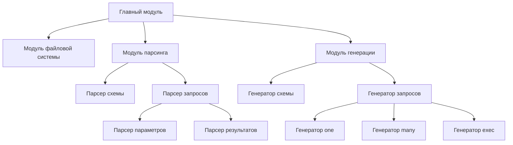

# План миграции SQLRC с JavaScript на Pascal

## 1. Общая структура проекта



## 2. Типы данных

### Конфигурация
```pascal
type
  TPackage = record
    Name: string;
    Path: string;
  end;

  TConfig = record
    Schema: string;
    Queries: array of string;
    RemoveTrailingS: Boolean;
    Package: TPackage;
  end;
```

### Схема
```pascal
type
  TColumnType = (ctText, ctInteger);
  
  TColumn = record
    Name: string;
    ColumnType: TColumnType;
    Nullable: Boolean;
  end;
  
  TTableColumns = record
    Columns: array of TColumn;
  end;
  
  TSchema = record
    Tables: array of record
      Name: string;
      Columns: array of TColumn;
    end;
  end;
```

### Запросы
```pascal
type
  TQueryReturnType = (qrtOne, qrtMany, qrtExec);
  
  TQueryToken = record
    SQL: string;
    Name: string;
    ReturnType: TQueryReturnType;
  end;
  
  TOwnType = (otString, otInteger);
  
  TQueryParam = record
    Name: string;
    ParamType: TOwnType;
    Positions: array of Integer;
  end;
  
  TParamedQuery = record
    QueryToken: TQueryToken;
    Params: array of TQueryParam;
    ResultSQL: string;
  end;
  
  TReturningField = record
    TableField: string;
    ReturningName: string;
  end;
  
  TTableResult = record
    TableName: string;
    Fields: array of TReturningField;
  end;
  
  TResolvedReturnQuery = record
    QueryToken: TQueryToken;
    Params: array of TQueryParam;
    ResultSQL: string;
    Results: array of TTableResult;
  end;
```

## 3. Модули и их функциональность

### 3.1. Модуль файловой системы (fs.pas)
- Функция для чтения конфигурационного файла в формате "key:value\n"
- Функция для чтения файлов схемы и запросов
- Функция для записи сгенерированных файлов

### 3.2. Модуль парсинга (parse.pas)
- Парсер схемы SQL
- Парсер запросов SQL
- Парсер параметров запросов
- Парсер результатов запросов

### 3.3. Модуль генерации (generate.pas)
- Генератор кода схемы
- Генератор кода запросов
- Генераторы для разных типов запросов (one, many, exec)

### 3.4. Главный модуль (sqlrc.pas)
- Обработка аргументов командной строки
- Координация работы всех модулей

## 4. Алгоритм работы

1. Чтение и парсинг конфигурационного файла
2. Чтение файлов схемы и запросов
3. Парсинг схемы SQL
4. Генерация кода схемы
5. Запись сгенерированного кода схемы в файл
6. Парсинг запросов SQL
7. Парсинг параметров запросов
8. Парсинг результатов запросов
9. Генерация кода запросов
10. Запись сгенерированного кода запросов в файл

## 5. Особенности реализации

### 5.1. Работа с текстовыми шаблонами
В Pascal нет встроенной поддержки регулярных выражений, поэтому мы будем использовать функции для обработки текста. Вот основные функции, которые нам понадобятся:

```pascal
// Функция для поиска подстроки в строке
function FindSubstring(const Source, SubStr: string; StartPos: Integer = 1): Integer;

// Функция для замены подстроки в строке
function ReplaceSubstring(const Source, OldSubStr, NewSubStr: string): string;

// Функция для разделения строки на части по разделителю
function SplitString(const Source, Delimiter: string): TStringArray;

// Функция для удаления пробелов в начале и конце строки
function Trim(const Source: string): string;

// Функция для проверки, начинается ли строка с определенной подстроки
function StartsWith(const Source, SubStr: string): Boolean;

// Функция для проверки, заканчивается ли строка определенной подстрокой
function EndsWith(const Source, SubStr: string): Boolean;

// Функция для извлечения подстроки из строки
function Substring(const Source: string; StartPos, Length: Integer): string;
```

Эти функции позволят нам эмулировать основные возможности регулярных выражений, необходимые для парсинга SQL-кода.

### 5.2. Работа с конфигурационным файлом
Вместо JSON мы будем использовать простой текстовый формат "key:value\n" для конфигурационного файла. Вот пример такого файла:

```
schema:schema.sql
queries:user.sql
remove_trailing_s:true
pakage.name:gen
pakage.path:./__gen/
```

Для парсинга такого файла мы будем использовать следующую функцию:

```pascal
function ParseConfig(const FilePath: string): TConfig;
var
  Lines: TStringArray;
  Line, Key, Value: string;
  i, SepPos: Integer;
begin
  // Чтение файла и разделение на строки
  Lines := ReadFileLines(FilePath);
  
  // Инициализация результата
  Result.Queries := nil;
  
  // Парсинг каждой строки
  for i := 0 to Length(Lines) - 1 do
  begin
    Line := Lines[i];
    SepPos := Pos(':', Line);
    if SepPos > 0 then
    begin
      Key := Trim(Copy(Line, 1, SepPos - 1));
      Value := Trim(Copy(Line, SepPos + 1, Length(Line) - SepPos));
      
      // Заполнение соответствующих полей конфигурации
      if Key = 'schema' then
        Result.Schema := Value
      else if Key = 'queries' then
      begin
        SetLength(Result.Queries, 1);
        Result.Queries[0] := Value;
      end
      else if Key = 'remove_trailing_s' then
        Result.RemoveTrailingS := LowerCase(Value) = 'true'
      else if Key = 'pakage.name' then
        Result.Package.Name := Value
      else if Key = 'pakage.path' then
        Result.Package.Path := Value;
    end;
  end;
end;
```

### 5.3. Работа с файлами
В Pascal есть встроенные средства для работы с файлами, которые мы будем использовать для чтения и записи файлов.

```pascal
// Функция для чтения файла в строку
function ReadFileToString(const FilePath: string): string;
var
  F: TextFile;
  Line: string;
begin
  Result := '';
  AssignFile(F, FilePath);
  Reset(F);
  while not Eof(F) do
  begin
    ReadLn(F, Line);
    Result := Result + Line + #13#10;
  end;
  CloseFile(F);
end;

// Функция для записи строки в файл
procedure WriteStringToFile(const FilePath, Content: string);
var
  F: TextFile;
begin
  AssignFile(F, FilePath);
  Rewrite(F);
  Write(F, Content);
  CloseFile(F);
end;
```

### 5.4. Генерация кода
Для генерации кода мы будем использовать строковые функции и шаблоны.

```pascal
// Функция для генерации кода схемы
function GenerateSchema(const Schema: TSchema; const PackageName: string; RemoveTrailingS: Boolean): string;
var
  Result, StructCode: string;
  i, j: Integer;
  TableName, StructName: string;
begin
  Result := 'package ' + PackageName + #13#10#13#10;
  Result := Result + 'import "database/sql"' + #13#10#13#10;
  Result := Result + 'type Queries struct {' + #13#10;
  Result := Result + '    DB *sql.DB' + #13#10;
  Result := Result + '}' + #13#10;
  
  for i := 0 to Length(Schema.Tables) - 1 do
  begin
    TableName := Schema.Tables[i].Name;
    StructName := Capitalize(TableName);
    
    if RemoveTrailingS and (Length(StructName) > 0) and (LowerCase(StructName[Length(StructName)]) = 's') then
      StructName := Copy(StructName, 1, Length(StructName) - 1);
    
    StructCode := #13#10 + 'type ' + StructName + ' struct {' + #13#10;
    
    for j := 0 to Length(Schema.Tables[i].Columns) - 1 do
    begin
      StructCode := StructCode + '    ' + Capitalize(Schema.Tables[i].Columns[j].Name) + ' ';
      
      case Schema.Tables[i].Columns[j].ColumnType of
        ctText: StructCode := StructCode + 'string';
        ctInteger: StructCode := StructCode + 'int';
      end;
      
      StructCode := StructCode + ' `db:"' + Schema.Tables[i].Columns[j].Name + '"`' + #13#10;
    end;
    
    StructCode := StructCode + '}' + #13#10;
    
    Result := Result + StructCode;
  end;
  
  GenerateSchema := Result;
end;
```

## 6. Структура файлов проекта

```
sqlrc/
├── sqlrc.dpr        # Главный файл проекта
├── src/
│   ├── types.pas    # Определения типов данных
│   ├── fs.pas       # Модуль файловой системы
│   ├── parse/
│   │   ├── schema.pas    # Парсер схемы
│   │   ├── query/        # Парсер запросов (если превышает 500 строк)
│   │   │   ├── parse.pas    # Парсер запросов
│   │   │   ├── params.pas   # Парсер параметров
│   │   │   └── result.pas   # Парсер результатов
│   └── generate/
│       ├── schema.pas    # Генератор схемы
│       ├── query.pas     # Генератор запросов
│       └── return/       # Генераторы для разных типов запросов
│           ├── one.pas   # Генератор для one
│           ├── many.pas  # Генератор для many
│           └── exec.pas  # Генератор для exec
└── bin/
    └── sqlrc.exe    # Скомпилированный исполняемый файл
```

## 7. Этапы реализации

1. Создание структуры проекта и определение типов данных
2. Реализация модуля файловой системы
3. Реализация парсера схемы
4. Реализация генератора схемы
5. Реализация парсера запросов
6. Реализация парсера параметров запросов
7. Реализация парсера результатов запросов
8. Реализация генератора запросов
9. Реализация генераторов для разных типов запросов
10. Интеграция всех модулей в главный модуль
11. Тестирование и отладка

## 8. Потенциальные проблемы и их решения

1. **Обработка текста**: Реализовать простые функции для обработки текста, которые будут эмулировать необходимые возможности регулярных выражений.
2. **Конфигурационный файл**: Использовать простой текстовый формат "key:value\n" вместо JSON.
3. **Динамические массивы**: Использовать динамические массивы Pascal для хранения данных переменной длины.
4. **Обработка ошибок**: Реализовать механизм обработки ошибок с использованием исключений Pascal.
5. **Кодировка текста**: Обеспечить правильную обработку различных кодировок текста.

## 9. Тестирование

1. Создать тестовые файлы схемы и запросов
2. Проверить правильность парсинга схемы
3. Проверить правильность генерации кода схемы
4. Проверить правильность парсинга запросов
5. Проверить правильность генерации кода запросов
6. Проверить работу программы в целом

## 10. Валидация результатов миграции

1. Сравнить сгенерированные файлы с ожидаемыми результатами
2. Проверить соответствие сгенерированных файлов требованиям
3. Проверить работу сгенерированных файлов в реальном проекте
4. Провести нагрузочное тестирование для проверки производительности

## 11. Документация

1. Создать документацию по использованию программы
2. Создать документацию по структуре проекта
3. Создать документацию по API
